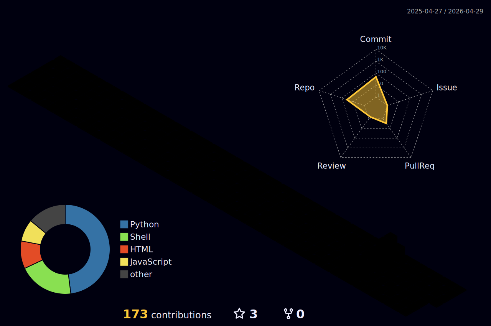

<!-- Header Banner -->


<!-- Tagline Badge -->
<p align="center">
  
</p>

<!-- Social Proof Badges -->
<p align="center">
  
  
  
</p>

<!-- Typing SVG -->
<p align="center">
  
</p>

<!-- Social Links -->
<p align="center">
  <a href="https://linkedin.com/in/tommieseals"></a>
  <a href="mailto:tommieseals7700@gmail.com"></a>
</p>


## 🐍 Watch My Contributions Get Eaten

<p align="center">
  <picture>
    <source media="(prefers-color-scheme: dark)" srcset="https://github.com/tommieseals/tommieseals/blob/output/github-contribution-grid-snake-dark.svg" />
    <source media="(prefers-color-scheme: light)" srcset="https://github.com/tommieseals/tommieseals/blob/output/github-contribution-grid-snake.svg" />
    
  </picture>
</p>


## The Short Version

I build infrastructure that runs itself. Self-healing services, intelligent monitoring, and automation that means I only touch systems when I *want* to, not when they break at 3 AM.

Currently training in Germany, building fintech ML systems, real-time AI applications, and distributed infrastructure. Everything I ship has CI passing, proper docs, and is production-ready.

**My philosophy:** *Build it once, automate it forever, never touch it again.*


## 🚀 Featured Portfolio Projects

<table>
<tr>
<td width="50%">

### 🦖 Tascosaur NLP
**Natural Language Task Management**

[](https://github.com/tommieseals/tascosaur-nlp)

Turn `"Create high-priority bug for login"` into structured tasks. NLP-powered Kanban with real-time WebSocket sync and cyberpunk UI.

`React` `Node.js` `NLP` `WebSocket` `SQLite`

</td>
<td width="50%">

### 💹 Investrain AI
**RAG-Powered Investment Tracker**

[](https://github.com/tommieseals/investrain-ai)

Chat with your portfolio: `"What's my highest-risk asset?"` AI analyzes holdings and returns data-driven insights.

`Next.js` `RAG` `Ollama` `Recharts` `Finance`

</td>
</tr>
<tr>
<td width="50%">

### 🚀 Sidekick PaaS
**Zero-Config Deployment Platform**

[](https://github.com/tommieseals/sidekick-paas)

Paste GitHub URL → Get deployed app with SSL. Auto-detects project type, generates Dockerfile, configures Nginx. Self-hosted Vercel alternative.

`Docker` `Nginx` `Certbot` `Node.js` `DevOps`

</td>
<td width="50%">

### 🌍 Teams UN-Translator
**Real-Time Meeting Translation**

[](https://github.com/tommieseals/teams-un-translator)

UN-style simultaneous interpretation for Teams meetings. Each participant hears their language in real-time (<1s latency).

`Teams Bot` `Whisper` `Claude` `ElevenLabs` `Real-time`

</td>
</tr>
</table>


## 🤖 ML/Infrastructure Projects

| | |
|:---:|:---:|
| **Credit Risk API** | **Fraud Detection** |
| [](https://github.com/tommieseals/credit-risk-api) | [](https://github.com/tommieseals/fraud-platform) |
| Real-time credit scoring with SHAP explainability | 0.99 AUC fraud detection with drift monitoring |
| **Incident Copilot** | **Node Health Monitor** |
| [](https://github.com/tommieseals/incident-copilot) | [](https://github.com/tommieseals/node-health-monitor) |
| 60% faster MTTR with auto log gathering | 99.9% uptime with auto-remediation |
| **LLM Router** | **Financial RAG** |
| [](https://github.com/tommieseals/llm-router) | [](https://github.com/tommieseals/fin-filings-rag) |
| Smart model routing with auto failover | SEC filing Q&A with intelligent abstention |


## ⏱️ Weekly Coding Stats

<!--START_SECTION:waka-->

```txt
From: 16 February 2026 - To: 23 February 2026

Total Time: 0 secs

No activity tracked
```

<!--END_SECTION:waka-->

> 💡 *Powered by [WakaTime](https://wakatime.com) - Install the plugin to track your coding activity!*


## Languages and Tools

<p align="center">
  
</p>


## 📊 3D Contribution Graph

<p align="center">
  
</p>


## GitHub Trophies

<p align="center">
  
</p>


## GitHub Stats

<p align="center">
  
  
</p>

<p align="center">
  
</p>


## Let's Connect

Building something interesting? Let's talk about distributed systems, ML infrastructure, or reliability engineering.

<p align="center">
  <a href="https://linkedin.com/in/tommieseals"></a>
  <a href="mailto:tommieseals7700@gmail.com"></a>
</p>

<!-- Footer -->

